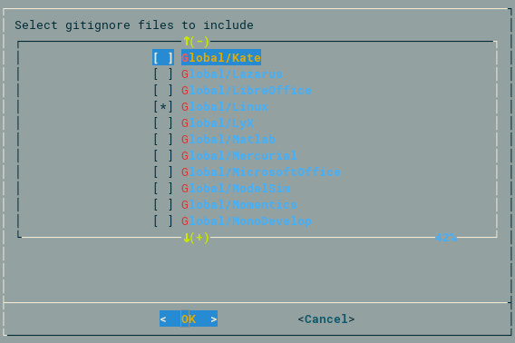

# Makegitignore

Generate ``.gitignore`` files from the command line.

## Dependencies

- Python (3.x is recommended, but should work on 2.7 as well)
- GNU find (or compatible)
- GNU dialog (or compatible)

## Example usage

    # This repo contains gitignore file definitions. Clone it to the
    # parent directory of the mkgitignore executable, or set
    # GITIGNORE_DIR in the environment
    git clone https://github.com/github/gitignore

    git clone https://github.com/rshk/mkgitignore

    # Link it somewhere in the PATH
    ln -s "${PWD}/mkgitignore/mkgitignore" ~/.local/bin/

    cd /path/to/MyProject
    mkgitignore > .gitignore

